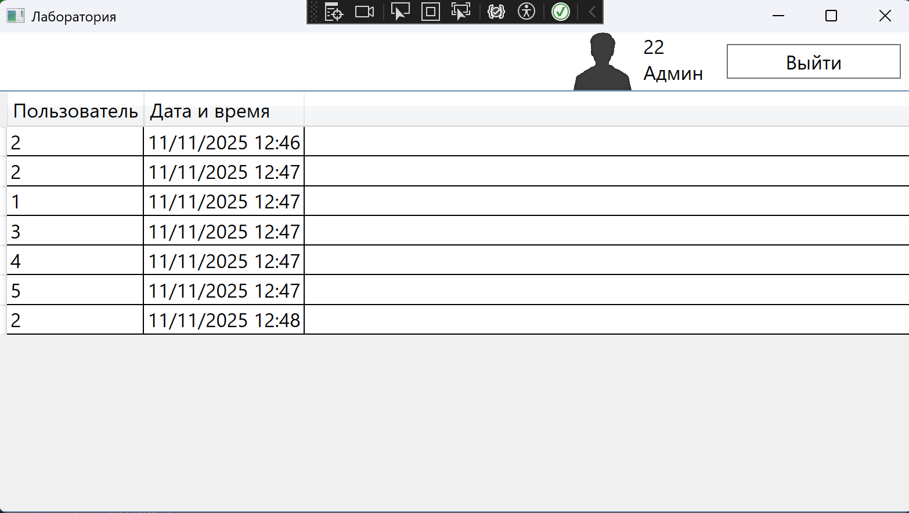

# Лаборатория


## Диаграмма сущность-связь


На диаграмме выше представлена структура базы данных проекта, включая основные сущности и связи между ними.


## Пример CAPTCHA


## Интерфейс таймера


## История входа





## Установка и запуск


```

сами установите -_-

```

